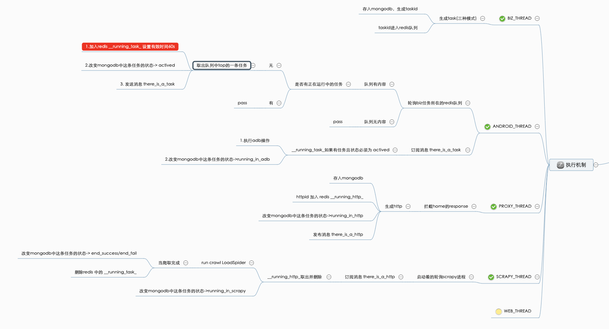

## 微信公众号爬虫项目
### 运行环境

> gemymotion(3.0.2)
- Custom Phone Api 8.0
- ARM_Translation_Oreo
- wechat 6.7.3

> virtualbox(6.0.x) gemymotion自带

> jdk 1.6+

> platform-tools
- adb 1.0.26

> nodejs 8.16.1+
- anyproxy

```javascript

    # anyproxy-ca 生成certi

```
> python 3.6.8
- pymongo 3.9.0
- redis 3.3.8
- scrapy 1.7.3

> mongodb 4.0.12

> redis 3

### 技术支持
> scrapy


### 运行原理
> 执行机制


### QUICK START

1. 先运行proxy线程

2. 再运行android线程

3. 再运行biz线程


### 联系方式
> wechat: 18921966826
### 项目架构TODO
1. redis内存数据库，加快数据库读写效率
2. hbase分布式数据库存储，用来解决大数据量
3. 分布式爬取，todo with scrapy-redis
4. 构建web项目，更友好的操作洁面
5. 权限体系，包月服务等收费措施

### FAQ （frequently asked questions ）
> 为什么要使用redis做消息队列
- 首先是因为有生产者消费者设计模式的必要，其次是因为js线程和python线程之间，python线程和python线程之间需要通信，所以依赖了redis

> 为什么要用wechat 6.7.3
- 7.0+ 官方对反爬虫做了一些应对措施，操作起来比较困难
- 6.7.3 这个因人而异 需要使用高版本ROM
- 6.5.8 有个查看历史按钮 位置不固定 其他都很固定
- 6.6.7 不错，基本满足我的要求 但是后来发现这个也会被提示强制升级